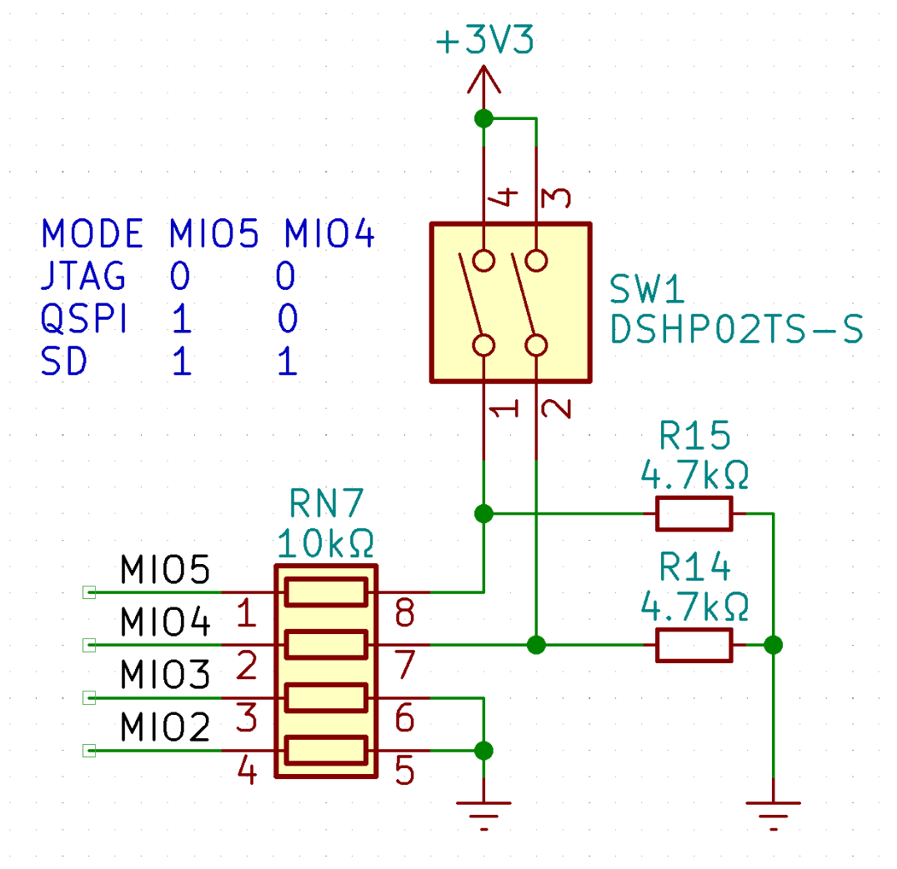

## 背景

最近调试某项目时，使用了 Zynq-7000 SoC + QSPI Flash 启动的方案，踩了一些相关的坑，记录一下。

<!--more-->

## Zynq 的启动流程和模式配置

Zynq 的启动流程在 [UG585](https://docs.xilinx.com/r/en-US/ug585-zynq-7000-SoC-TRM/) 里面有详细的描述，如图所示：


主要流程是 BootROM -> FSBL -> U-Boot -> Linux，其中 BootROM 固化在芯片内，FSBL 代码公开，通常由 PetaLinux 等工具生成。我的项目中同时使用 PetaLinux 编译 U-Boot 和 Linux。

BootROM 会读取 Strapping Pins 的状态，相关的 MIO 包括 `MIO[6:2]`，在大部分场景中，只通过 `MIO[5:4]` 选择 JTAG、QSPI、NAND、SD 卡四种方式之一。这部分的原理图如图，其中开关 SW1 可以控制 MIO4、MIO5 的上下拉状态，进而控制启动模式。



## 第一个坑：QSPI Flash 与 MIO4、MIO5 的复用

由于 BootROM 的代码是固化在芯片里的，所以各个启动模式使用的管脚绑定也是固定的，不能随意选择。具体而言，在 QSPI 启动模式下，管脚的绑定在 [UG585](https://docs.xilinx.com/r/en-US/ug585-zynq-7000-SoC-TRM/MIO-Programming?tocId=wD0CLYeiyK3CkYKGWB8hRw) 中有描述，实际用到的如下表：

| Quad-SPI I/O Interface Signal Name | MIO Pin Number | Direction | I/O Buffer Output, Pull-up | External Connection |
|:----------------------------------:|:--------------:|:---------:|:--------------------------:|:-------------------:|
|              QSPI_CS0              |      MIO 1     |     O     |           Enabled          |          ~          |
|            QSPI_IO[0:3]            |   MIO 2 to 5   |    I/O    |           Enabled          |     Pull up/down    |
|             QSPI_SCLK0             |      MIO 6     |     O     |           Enabled          |     Pull up/down    |

在这里，比较坑的就是 QSPI_IO2 -> MIO4，以及 QSPI_IO3 -> MIO5 两个绑定，上面提到，MIO4 和 MIO5 同时用来在启动时选择启动模式，因此会有一个初始化的电平配置。而同时，对于大部分 Flash 芯片，QSPI_IO3 在单线 SPI 模式下复用为 HOLD#/RESET#，如果在开关上配置了低电平，使用单线 SPI 命令操作 Flash 就会出现 HOLD# 被持续拉低，不能写入数据的问题。

解决方案：需要持久化配置 Flash 的 `QE=1`，这样在启动时，Flash 就会进入四线模式，忽略 HOLD# 的电平。具体的操作因 Flash 厂商有所区别，我使用的是 MXIC 的 MX25L25635F，[Application Note](https://www.macronix.com/Lists/ApplicationNote/Attachments/1903/AN0245V2%20-%20Using%20Macronix%20Serial%20Flash%20with%20Xilinx%20iMPACT%20Tools.pdf) 给出了一个比较详细的说明，具体流程引用如下：

> The QE bit can be set by issuing the WREN command (06h) followed by the WRSR command (01h) with 40h as the data. The RDSR command (05h) can be used to read the Status Register to confirm that the QE bit has been set.

## 第二个坑：如何在 JTAG 启动模式下配置 QE=1

说起来，这块板子之前一直使用了 `W25Q128JVSIQ` 这款 16MB 的 Flash，因为这款 Flash 的型号结尾是 Q，出厂就固化了 QE=1，所以一直没有发现这个问题。后来因为项目需要，换上了手边有的这款 32MB Flash，没想到就踩了刚刚提到的这个坑。

因此，需要通过 U-Boot，配置一次 Flash 的 QE=1。U-Boot 的源码实际上会在 `sf probe` 时，直接进行一次这个配置，相关的源码在 `drivers/mtd/spi/spi-nor-core.c` 中。针对我用的这款 Flash，代码如下：

```c
#if defined(CONFIG_SPI_FLASH_MACRONIX) || defined(CONFIG_SPI_FLASH_ISSI)
/**
 * macronix_quad_enable() - set QE bit in Status Register.
 * @nor:	pointer to a 'struct spi_nor'
 *
 * Set the Quad Enable (QE) bit in the Status Register.
 *
 * bit 6 of the Status Register is the QE bit for Macronix like QSPI memories.
 *
 * Return: 0 on success, -errno otherwise.
 */
static int macronix_quad_enable(struct spi_nor *nor)
{
	int ret, val;

	val = read_sr(nor);
	if (val < 0)
		return val;
	if (val & SR_QUAD_EN_MX)
		return 0;

	write_enable(nor);

	write_sr(nor, val | SR_QUAD_EN_MX);

	ret = spi_nor_wait_till_ready(nor);
	if (ret)
		return ret;

	ret = write_disable(nor);
	if (ret)
		return ret;

	ret = read_sr(nor);
	if (!(ret > 0 && (ret & SR_QUAD_EN_MX))) {
		dev_err(nor->dev, "Macronix Quad bit not set\n");
		return -EINVAL;
	}

	return 0;
}
#endif
```

可以看到，这里首先读取了 SR，如果其中的 QE 没有设置的话，就会进行 `write_enable` 和 `write_sr` 操作。那么问题来了，如果在 JTAG 启动模式下，这两个操作是无法成功的，因为 Flash 的 WP# 和 HOLD# 都因为 MIO4、MIO5 的配置而被拉低了。所以 U-Boot 启动的时候，就会报出 `Macronix Quad bit not set` 这个比较奇怪的错误。

解决方案：既然知道了问题，解决起来也算简单。首先把 MIO4、MIO5 都设置为低电平，给板子上电，使 Zynq 正常进入 JTAG 启动；然后趁机快速把两个引脚的开关都切换到高电平，这样 Flash 的 WP# 和 HOLD# 就会被拉高，U-Boot 的 `sf probe` 就可以正常成功了。因为 QE 这个 bit 的配置是持久化的，所以之后就不会再有问题了。

## 第三个坑：PetaLinux 里面的各种配置

### PetaLinux 
PetaLinux 里面可以配置各种启动相关的参数。和 QSPI Boot 相关的列举如下：

* `Subsystem AUTO Hardware Settings -> Flash Settings` 设置 Primary Flash 为 `ps7_qspi_0`，同时设置 Flash 的分区信息。这里我的分区设置如下表，供参考：

| Partition Name | Flash Offset | Partition Size |
|:--------------:|:------------:|:--------------:|
|       boot     | `0x00_0000`  |  `0x5e_0000`   |
|     bootenv    | `0x5e_0000`  |  `0x1_0000`   |
|     bootscr    | `0x5f_0000`  |  `0x1_0000`   |
|      kernel    | `0x60_0000`  |  `0x80_0000`   |
|      jffs2     | `0xe0_0000`  |  `0x120_0000`   |

* `Subsystem AUTO Hardware Settings -> Advanced bootable images storage Settings` 设置 `boot image`、`u-boot env`、`kernel image`、`jffs2 rootfs` 的存储位置为 `primary flash`，由于我们使用 FIT image，`dtb image` 的存储位置为 `from boot image`。
* `Auto Config Settings` 中，禁用掉 `u-boot autoconfig`，方便我们后续修改 U-Boot 的配置。
* `u-boot Configuration` 中，使用默认的 `other` 配置，并且保持 `u-boot config target` 为 `xilinx_zynq_virt_defconfig`。

### U-Boot
PetaLinux 提供了一个命令 `petalinux-config -c u-boot` 可以调出 U-Boot 的 menuconfig，但是在我这里（2020.1 版本），在这里配置的各项参数不会被 PetaLinux 写入 `meta-user` 下的配置文件，因此只好自己动手。

参考 [AR75730 - 2020.x-2021.x PetaLinux: Why does platform-top.h not work in U-Boot distro boot](https://support.xilinx.com/s/article/75730?language=en_US)，这里似乎是踩了版本的坑。按照教程，手动参考以下内容修改 `project-spec/meta-user/recipes-bsp/u-boot/u-boot-xlnx_%.bbappend` ：

```
SRC_URI_append = " \
	file://platform-top.h \
	file://bsp.cfg \
"

do_configure_append () {
        if [ "${U_BOOT_AUTO_CONFIG}" = "1" ]; then
                install ${WORKDIR}/platform-auto.h ${S}/include/configs/
                install ${WORKDIR}/platform-top.h ${S}/include/configs/
        else
                install ${WORKDIR}/platform-top.h ${S}/include/configs/
	fi
}
```

可以看到，这里使用了一个新的 `bsp.cfg` 存放 U-Boot 配置，同时在 `do_configure_append` 中，把 `platform-top.h` 拷贝到了 `include/configs` 下。

这里的 `bsp.cfg`，参考我们的分区配置如下：

```
CONFIG_SYS_CONFIG_NAME="platform-top"
CONFIG_BOOT_SCRIPT_OFFSET=0x5F0000
CONFIG_ENV_SIZE=0x10000
CONFIG_ENV_OFFSET=0x5E0000
```

第一行指明 config name 为 `platform-top`，即 include 编写的 `platform-top.h` 文件。后面指定了 `bootscr` 和 `bootenv` 分区的偏移和大小。

### U-Boot Script
U-Boot Script（`boot.scr`）由 PetaLinux 自动生成，但其中的 Kernel Offset 等参数需要手动修改，修改 `project-spec/meta-user/recipes-bsp/u-boot/u-boot-zynq-scr.bbappend`，其中的参数会在 `do_compile` 步骤时由 `sed` 替换进 `${WORKDIR}/boot.cmd.${BOOTMODE}.${SOC_FAMILY}` 文件。具体修改的参数如下：

```
QSPI_KERNEL_OFFSET_zynq = "0x600000"
QSPI_FIT_IMAGE_SIZE_zynq = "0x800000"
```

由于这个文件里面的内容比较多，涉及到了 zynq、versal、zynqmp 等几个平台，很容易修改错误，需要仔细检查。

这里还有一个坑，PetaLinux 有时候不会自动 rebuild `boot.scr`，导致修改的参数不会生效。这时候可以使用 `petalinux-build -c u-boot-zynq-scr -x distclean` 彻底清理 `u-boot-zynq-scr` 这个 recipe，然后再次编译。
